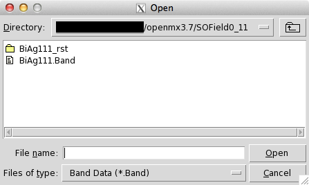
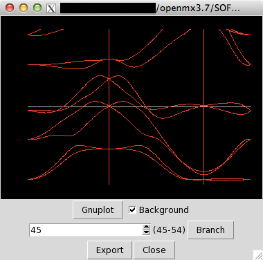

# OMXTool
Graphical Utility Tool for [OpenMX](http://www.openmx-square.org).

Copyright (C), 2015-2017, Naoya Yamaguchi.

This software includes the work that is distributed in version 3 of the GPL (GPLv3).

## Log:
- 2015/07/10 Ver. alpha-1 Written by Naoya Yamaguchi.
- 2015/07/13 Ver. alpha-2 Written by Naoya Yamaguchi.
- 2015/07/15 Ver. alpha-3 Written by Naoya Yamaguchi.
- 2015/07/16 Ver. alpha-4 Written by Naoya Yamaguchi.
- 2015/08/24 Ver. alpha-5 Written by Naoya Yamaguchi.
- 2015/11/12 Ver. beta-1 Written by Naoya Yamaguchi.
- 2016/03/17 Ver. alpha-6 Written by Naoya Yamaguchi.
- 2016/06/11 Ver. 1.0 Released by Naoya Yamaguchi.
- 2016/08/19 Ver. 1.1 Released by Naoya Yamaguchi.
- 2016/09/23 Ver. 1.2 Released by Naoya Yamaguchi.
- 2016/10/01 Ver. 1.2.1 Modified by Naoya Yamaguchi.
- 2016/10/04 Ver. 1.2.2 Modified by Naoya Yamaguchi.
- 2016/10/18 Ver. 1.2.3 Modified by Naoya Yamaguchi.
- 2016/12/09 Ver. 1.2.4 Modified by Naoya Yamaguchi.
- 2016/12/17 Ver. 1.3 Released by Naoya Yamaguchi.
- 2016/12/18 Ver. 1.3.1 Modified by Naoya Yamaguchi.
- 2017/01/02 Ver. 1.3.2 Modified by Naoya Yamaguchi.
- 2017/01/15 Ver. 1.4 Released by Naoya Yamaguchi.
  (renaming 'openmx.tcl' 'OMXTool.tcl')
- 2017/02/11 Ver. 1.4.1 Modified by Naoya Yamaguchi.
- 2017/02/13 Ver. 1.4.2 Modified by Naoya Yamaguchi.
  (renaming 'OMXTool.tcl' 'omxtool')

## Usage:
   `./omxtool`
   
   or:
   
   `./omxtool &`
   
## Description:
   This script provides graphical utilities for OpenMX.
   **OMXTool** enables you to do the following processes through a GUI.

### Using OMXTool, you can
   - draw figures of band dispersions.
   
## How to
### start up:
1. Try `./omxtool` and launch a GUI of **OMXTool** as shown in the figure below.

- We recommend to launch 'OMXTool' as a background process (*i.e.* `./omxtool &`).

### draw figures of band dispersions:
1. Click the `Band` button.
1. Select a \*.Band file and you can see a preview of the band dispersion as shown in the figure below.

- How to save the figures:
  1. Click the `Export` button and open a dialog box to save the figure.
  2. Save the figure through the dialog box.

